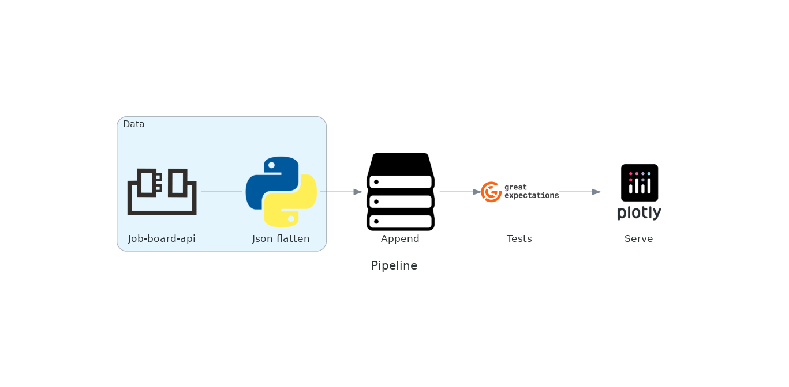

# IT Job Posting Data App

This project grabs data from a job posting website and uses Plotly/Dash for visualizations.

## Getting Started

Paths should be configured in the config.yaml file. They dictate where the data is stored and read by the dash app. 

### Running

Run the pipeline first.
Then simply go to localhost:8050 in your browser.
The web app may cause a temporary timeout error but this is due to the map taking a long time to load (many marker locations). Just need some patience :) Also the pipeline can be rerun to collect more and more data. 

